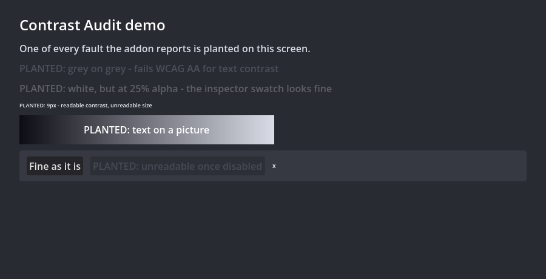

# Contrast Audit Lite

**Free version of [Contrast Audit](https://theidlehands.itch.io/contrast-audit) for Godot 4.4 – 4.7.**

Checks the scene you have open: text contrast (WCAG 2.1, after alpha and `modulate`), contrast in the hover / pressed / disabled / focus states, clickable areas under 24x24, and fonts below a size floor.

## Getting started

1. Copy `addons/contrast_audit/` into your project.
2. **Project → Project Settings → Plugins**, enable **Contrast Audit Lite**.
3. The dock appears bottom-right. Open a saved scene and press **Check open scene**.

The `demo/` folder is a small project with one of every fault planted in it.

## The full version adds

- **Check all scenes** in one press
- **Markdown and JSON reports** (pinned schema for a build server)

→ **[Contrast Audit on itch.io](https://theidlehands.itch.io/contrast-audit)**

The full version installs into the same `addons/contrast_audit/` folder, so it replaces
this one in place.

## What it will not tell you

A clean report is a measurement against the checks above, not a guarantee.
The full version's page lists every limit in detail.

## Licence

The Lite version is MIT licensed (see `LICENSE`). The full version is sold
separately under its own licence.
